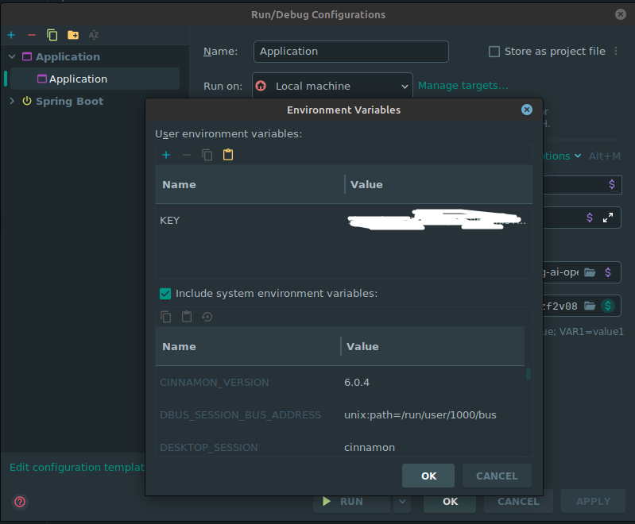

# Oficina: Turbinando suas APIs - A Tríade Imbatível de Spring AI, OpenAI e AWS Bedrock

Olá, futuro(a) engenheiro(a) de software e entusiasta de IA!

Seja muito bem-vindo(a) ao repositório oficial da nossa oficina. Aqui você encontrará todo o material, código-fonte e instruções necessárias para acompanhar nossa jornada e aprender a construir APIs Java superpoderosas, integradas com os mais modernos modelos de Inteligência Artificial.

Prepare-se para explorar a sinergia entre o framework **Spring AI**, os modelos de ponta da **OpenAI** e a robustez da plataforma **AWS Bedrock**.

---

## Índice

- [Oficina: Turbinando suas APIs - A Tríade Imbatível de Spring AI, OpenAI e AWS Bedrock](#oficina-turbinando-suas-apis---a-tríade-imbatível-de-spring-ai-openai-e-aws-bedrock)
  - [Índice](#índice)
  - [1. Sobre a Oficina](#1-sobre-a-oficina)
  - [2. A Tríade Imbatível: Por que essa combinação?](#2-a-tríade-imbatível-por-que-essa-combinação)
  - [3. Objetivos de Aprendizagem](#3-objetivos-de-aprendizagem)
  - [4. Pré-requisitos (MUITO IMPORTANTE!)](#4-pré-requisitos-muito-importante)
    - [Conhecimentos Essenciais:](#conhecimentos-essenciais)
    - [Ferramentas Necessárias:](#ferramentas-necessárias)
  - [5. Configuração do Ambiente (Passo a Passo)](#5-configuração-do-ambiente-passo-a-passo)
    - [Passo 1: Clone o Repositório](#passo-1-clone-o-repositório)
    - [Passo 2: Configure suas Credenciais](#passo-2-configure-suas-credenciais)
    - [Passo 3: Execute o Projeto](#passo-3-execute-o-projeto)
  - [6. Estrutura do Projeto](#6-estrutura-do-projeto)
  - [7. Nossos Exemplos Práticos](#7-nossos-exemplos-práticos)
  - [8. Postman para acessar todos os endpoints](#8-postman-para-acessar-todos-os-endpoints)
  - [9. Contato e Dúvidas](#9-contato-e-dúvidas)

---

## 1. Sobre a Oficina

Nesta oficina prática, vamos mergulhar no universo da Inteligência Artificial Generativa aplicada ao desenvolvimento de software. 

O objetivo é claro: demonstrar como integrar, de forma simples e eficiente, modelos de linguagem avançados (LLMs) em suas aplicações Spring Boot. Ao final, você será capaz de criar serviços web que pensam, geram conteúdo, analisam informações e muito mais.

## 2. A Tríade Imbatível: Por que essa combinação?

Chamamos essa combinação de "tríade imbatível" por um motivo. Cada componente desempenha um papel fundamental:

* **☕ Spring AI:** Atua como nosso maestro. É um novo projeto do ecossistema Spring que abstrai a complexidade de interagir com diferentes provedores de IA. Com ele, podemos trocar o modelo da OpenAI pelo da AWS (ou outro) com uma simples mudança de configuração, sem alterar nosso código de lógica de negócio. **Produtividade e flexibilidade na veia!**

* **🧠 OpenAI:** É o cérebro criativo e um dos pioneiros no campo dos LLMs. Usaremos sua API para acessar modelos mundialmente famosos como o GPT-3.5 e o GPT-4, conhecidos por sua impressionante capacidade de geração de texto e conversação.

* **☁️ AWS Bedrock:** É o canivete suíço da AWS para IA Generativa. Ele nos dá acesso a uma variedade de modelos de diferentes empresas (como Anthropic, Cohere, e os próprios modelos Titan da Amazon) em um ambiente totalmente gerenciado, seguro e escalável. **É a garantia de robustez e versatilidade para nossas aplicações em produção.**

Juntos, eles nos oferecem uma arquitetura poderosa: a simplicidade do Spring, a criatividade da OpenAI e a escalabilidade da AWS.

## 3. Objetivos de Aprendizagem

Ao concluir esta oficina, você será capaz de:

* **Entender** os conceitos fundamentais do projeto Spring AI.
* **Configurar** um projeto Spring Boot para se comunicar com a API da OpenAI.
* **Integrar** o mesmo projeto com o AWS Bedrock para consumir modelos como o Claude.
* **Desenvolver** endpoints de API RESTful que utilizam IA para resolver problemas reais (ex: sumarização, chat, análise de sentimentos).
* **Compreender** as vantagens de usar uma camada de abstração como o Spring AI para desacoplar sua aplicação dos provedores de modelos.

## 4. Pré-requisitos (MUITO IMPORTANTE!)

Não é necessario!

### Conhecimentos Essenciais:

* Conhecimento básico de **Java** e do framework **Spring Boot**.
* Familiaridade com o conceito de **APIs REST**.
* Noções básicas de uso do **Git** e do GitHub.

### Ferramentas Necessárias:

1.  **Java Development Kit (JDK)**: Versão **17** ou superior.
2.  **Maven** ou **Gradle**: Para gerenciamento de dependências (nosso projeto usa Maven).
3.  **IDE de sua preferência**: IntelliJ IDEA.
4.  **Git**: Para clonar este repositório.
5.  **Conta na OpenAI**:
    * Acesse [platform.openai.com](https://platform.openai.com/).
    * Crie sua conta e gere uma **API Key**. Guarde-a em um local seguro!
  
6.  **Conta na AWS**:
    * Acesse [aws.amazon.com](https://aws.amazon.com/) e crie uma conta (o nível gratuito é suficiente para nossa oficina).
    * Após o login, procure pelo serviço **Amazon Bedrock**.
    * No menu do Bedrock, vá em **"Model access"** e solicite acesso aos modelos que deseja usar (ex: `Anthropic -> Claude`). A aprovação pode levar alguns minutos.
    * Instale e configure a **AWS CLI** em sua máquina para que a aplicação possa se autenticar. Siga [este guia](https://docs.aws.amazon.com/cli/latest/userguide/cli-chap-configure.html).

## 5. Configuração do Ambiente (Passo a Passo)

Siga estas instruções para deixar tudo pronto para a oficina.

### Passo 1: Clone o Repositório

Abra seu terminal e execute o seguinte comando:

```bash
git clone [https://github.com/weder96/UniOficina2025.git](https://github.com/weder96/UniOficina2025.git)
cd UniOficina2025
```

### Passo 2: Configure suas Credenciais

**NUNCA** coloque suas chaves de API diretamente no código ou em arquivos versionados pelo Git!

1.  Navegue até a pasta `src/main/resources`.
2.  Você encontrará um arquivo chamado `application.properties`.
3.  Abra o novo arquivo `application.properties` e preencha com suas chaves:





```properties
# ===================================================================
# OpenAI Configuration
# ===================================================================
spring.ai.openai.api-key=${KEY}
```


```properties
# ===================================================================
# AWS Bedrock Configuration
# ===================================================================
# O Spring AI usará as credenciais configuradas na sua AWS CLI.
# Apenas garanta que a região está correta.
#Mas se quiser vc pode informar devido a ter varios profiles


spring.ai.bedrock.aws.access-key=${ACCESS_KEY}
spring.ai.bedrock.aws.secret-key=${SECRET_KEY}

spring.ai.aws.region=us-east-1

# Modelo da Anthropic via Bedrock
spring.ai.aws.bedrock.anthropic.chat.model=anthropic.claude-v2:1

# Modelo Titan da Amazon via Bedrock
spring.ai.aws.bedrock.amazon.chat.model=amazon.titan-text-express-v1

```

### Passo 3: Execute o Projeto

Com tudo configurado, abra o projeto na sua IDE ou use o terminal para iniciá-lo:

```bash
# Usando Maven
mvn spring-boot:run
```

Se tudo deu certo, você verá o logo do Spring Boot no seu console e a aplicação estará rodando na porta `8080`.

## 6. Estrutura do Projeto

O projeto segue a estrutura padrão do Spring Boot para facilitar a localização dos arquivos:

* `src/main/java`: Onde fica todo o nosso código-fonte Java.
    * `dev.wsousa.controller`: Nossos endpoints REST.
    * `dev.wsousa.service`: comunicação com o Spring AI com o controller e a implementação.
    * `dev.wsousa.service.impl`: A lógica de negócio e implementação.
    * `dev.wsousa.dto`: Objetos de Transferência de Dados para as requisições e respostas.
      
* `src/main/resources`: Arquivos de configuração.
    * `application.properties`: Onde configuramos nossas chaves e perfis.
* `pom.xml`: O coração do nosso projeto Maven, onde declaramos todas as dependências (Spring Web, Spring AI, etc.).

## 7. Nossos Exemplos Práticos

Durante a oficina, vamos construir e testar alguns endpoints, como:

* `GET /vacation/unstructured`: Um endpoint para conversar com o modelo da OpenAI.
* `GET /actor/films-by-actor`: O mesmo endpoint, mas utilizando um modelo do AWS Bedrock.
* `GET /vacation/structured`: Uma API que recebe um texto longo e utiliza IA para gerar um resumo conciso.

## 8. Postman para acessar todos os endpoints

[Documentation](https://github.com/weder96/UniOficina2025/tree/main/Documentation)

Somente importar os dois arquivos no postman e subir qual aplicação vc deseja, OpenAI ou AWS Bedrock


## 9. Contato e Dúvidas

Se tiver qualquer problema na configuração do ambiente ANTES da oficina, sinta-se à vontade para abrir uma *Issue* neste repositório. Durante o evento, teremos monitores para auxiliar com qualquer dúvida.


---

**Nos vemos na em Breve nobres, futuro(a)s engenheiro(a)s de software   !** 

Prepare-se para destravar um novo superpoder no seu arsenal de desenvolvimento.